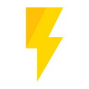

<!-- PROJECT LOGO -->
 

  

<h1 align="center">Yazdun.com</h1>

  

    This is my personal website which features my portfolio and markdown blog
     
    <a href="https://yazdun.com/"><strong>View live website »</strong></a>
     
     
    <a href="https://github.com/Yazdun/yazdun.com/tree/main/posts/">Articles</a>
    ·
    <a href="https://github.com/Yazdun/yazdun.com/issues">Report Bug</a>
    ·
    <a href="https://github.com/Yazdun/yazdun.com/issues">Request Feature</a>
  

 

## About this repository

- This is my personal website which is built with Next.
- You can find all the articles in `/posts` directory.
- There is no **license** ! feel free to use any piece of code you find on this
  repository.

## Contributing

This is open source project and you can open pull request to update a blog post
or any other possible improvements ! contributions are **greatly appreciated**.

1. Fork the Project
2. Create your Feature Branch (`git checkout -b feature/AmazingFeature`)
3. Commit your Changes (`git commit -m 'Add some AmazingFeature'`)
4. Push to the Branch (`git push origin feature/AmazingFeature`)
5. Open a Pull Request
